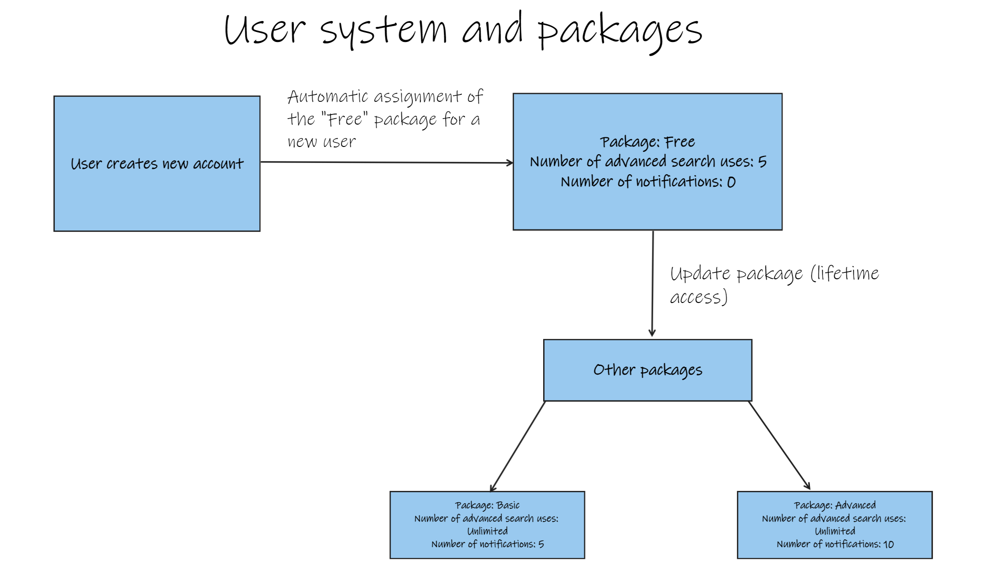
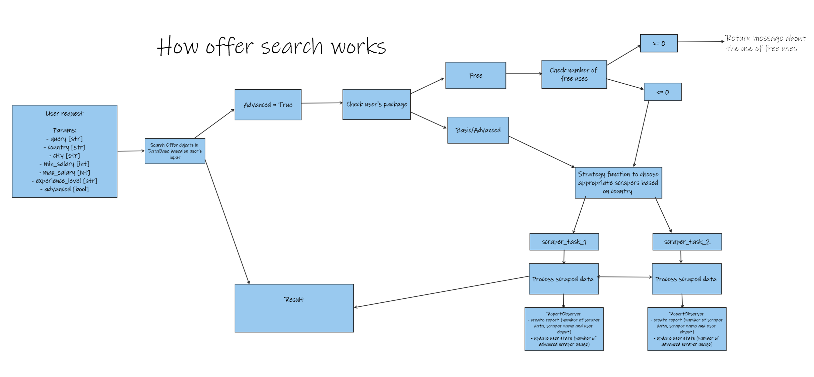

[![Contributors][contributors-shield]][contributors-url]
[![Forks][forks-shield]][forks-url]
[![Stargazers][stars-shield]][stars-url]
[![Issues][issues-shield]][issues-url]
[![MIT License][license-shield]][license-url]
[![LinkedIn][linkedin-shield]][linkedin-url]


<br />
<div align="center">

  <h2 align="center">FJob</h3>

  <p align="center">
    Application to search for job advertisements around the world. By scraping multiple job portals, you won't miss anything. 
    <br />
    <br />
    <a href="https://github.com/DEENUU1/fjob/issues">Report Bug</a>
    ·
    <a href="https://github.com/DEENUU1/fjob/issues">Request Feature</a>
  </p>

  <a href="https://github.com/DEENUU1/">

  </a>
</div>


## Info

This project is still in develop. The core of a project is already implemented, I am still working on a notification system, frontend (React) and adding new scrapers.

<!-- ABOUT THE PROJECT -->
## About The Project


## Key Features
- User system: registration, login, logout, password change
- Payment system: stripe, after registration user get a trial version which allows to use advanced scraping 5 times. User is able to buy "Basic" and "Premium" package to get all features like unlimited usage of advanced scraping and notification system.
- Scrapers: there are 2 types of scrapers:
  - dynamic scrapers can be run while making an advanced search and the data are scraped based on user's preferences
  - static scrapers are run automatically once a day and data are saved to database
- Contact form

### Built With

- Python
  - Django Rest Framework
  - Celery
  - Django Celery Beat
- PostgreSQL
- Docker and Docker-compose

## Graph of how user system and paid packages works


## Graph of how offer search works


## List of scrapers
### Dynamic:
- <a href="https://www.olx.pl/praca/"> OLX </a>
- <a href="https://www.pracuj.pl/"> Pracuj.pl </a>

### Static:
- <a href="https://justjoin.it"> Justjoin IT </a>
- <a href="https://nofluffjobs.com"> NoFluffJobs </a>
- <a href="https://praca.pl"> Praca PL </a>
- <a href="https://theprotocol.it"> TheProtocol </a>

## Endpoints

### /users/register
```bash
curl --location 'http://127.0.0.1:8000/users/register' \
--header 'Content-Type: application/json' \
--data-raw '{
    "username": "kacper2test1",
    "email": "kacper2@example.com",
    "password": "test123"
}'
```
```bash
{
    "message": "ok"
}
```

### /users/login
```bash
curl --location 'http://localhost:8000/users/login' \
--header 'Content-Type: application/json' \
--header 'Cookie: csrftoken=ZN8CQTzGYp3jn68HzaAAXauNOKURbVrA; sessionid=2qqm4vlcbwrpbc4rhtusmkcbjm58cbln' \
--data '{
    "username": "kacper2test1",
    "password": "test123"
}'
```
```bash
{
    "message": "ok"
}
```

### /users/authenticated
```bash
curl --location 'http://localhost:8000/users/authenticated' \
--header 'Cookie: csrftoken=ZN8CQTzGYp3jn68HzaAAXauNOKURbVrA; sessionid=2qqm4vlcbwrpbc4rhtusmkcbjm58cbln'
```
```bash
{
    "isAuthenticated": "success"
}
```


### /users/logout
```bash
curl --location --request POST 'http://localhost:8000/users/logout' \
--header 'X-CSRFToken: ZN8CQTzGYp3jn68HzaAAXauNOKURbVrA' \
--header 'Cookie: csrftoken=ZN8CQTzGYp3jn68HzaAAXauNOKURbVrA'
```
```bash
{
    "message": "Ok"
}
```

### /users/change-password
```bash
curl --location --request PUT 'http://localhost:8000/users/change-password' \
--header 'X-CSRFToken: 0rbEW1c7hlbrsYfgGifRWvTUsB42R0NS' \
--header 'Content-Type: application/json' \
--header 'Cookie: csrftoken=0rbEW1c7hlbrsYfgGifRWvTUsB42R0NS; sessionid=2ipdxopgwmkc3kzgsblvbft1z3f1dvdv' \
--data '{
    "old_password": "test123",
    "new_password": "test"
}'
```
```bash
{
    "message": "ok"
}
```


### /users/account-delete
```bash
curl --location --request DELETE 'http://localhost:8000/users/account-delete' \
--header 'X-CSRFToken: FO4hUOSPhQqG62TZIDYsa44eMTBNoByA' \
--header 'Content-Type: application/json' \
--header 'Cookie: csrftoken=FO4hUOSPhQqG62TZIDYsa44eMTBNoByA; sessionid=8vbapt81k7z7x1ecviskugvg06qfclab' \
--data-raw '{
    "username": "kacper2test1",
    "email": "kacper2@example.com",
    "password": "test"
}'
```

### /payment
```bash
curl --location 'http://localhost:8000/payment' \
--header 'Cookie: csrftoken=vQgj54MXMmi98kcjwTkvq1KoWVMisxHf; sessionid=0w2coyh9hv7s30tigopxmied0mupjc2q'
```
```bash
[
    {
        "name": "Advanced",
        "price": 500,
        "has_signals": true,
        "num_of_signals": 0
    },
]
```

### /payment/user-free-uses
```bash
curl --location 'http://localhost:8000/payment/user-free-uses' \
--header 'Cookie: csrftoken=vQgj54MXMmi98kcjwTkvq1KoWVMisxHf; sessionid=0w2coyh9hv7s30tigopxmied0mupjc2q'
```
```bash
{
    "free_uses": 5
}
```

### /payment/chs/<int:package_id>/
```bash
curl --location 'http://localhost:8000/payment/chs/2' \
--header 'Cookie: csrftoken=vQgj54MXMmi98kcjwTkvq1KoWVMisxHf; sessionid=0w2coyh9hv7s30tigopxmied0mupjc2q'
```
```bash
{
    "url": "https://checkout.stripe.com/c/pay/cs_test_YHgl"
}
```

### /payment/< str:custom_id >
### /payment/cancel

### /payment/user-package
```bash
curl --location 'http://localhost:8000/payment/user-package' \
--header 'Cookie: csrftoken=vQgj54MXMmi98kcjwTkvq1KoWVMisxHf; sessionid=0w2coyh9hv7s30tigopxmied0mupjc2q'
```
```bash
{
    "name": "Free",
    "price": 0
}
```

### /offers
```bash
curl --location 'http://localhost:8000/offers/?advanced=true&query=junior%20python&country=Poland' \
--header 'Cookie: csrftoken=vQgj54MXMmi98kcjwTkvq1KoWVMisxHf; sessionid=0w2coyh9hv7s30tigopxmied0mupjc2q'

params:
- query [str]
- country [str]
- city [str]
- min_salary [int]
- max_salary [int]
- experience_level [str]
- advanced [bool]
```

```json
[
     {
        "id": 848873599,
        "salary": [
            {
                "salary_from": 20,
                "salary_to": 22,
                "currency": "PLN",
                "contract_type": "['selfemployment', 'other', 'contract', 'zlecenie']",
                "work_schedule": "parttime"
            }
        ],
        "title": "Zatrudnię - opiekun/pomoc do osoby leżącej",
        "offer_id": null,
        "url": "https://www.olx.pl/oferta/praca/zatrudnie-opiekun-pomoc-do-osoby-lezacej-CID4-IDWrMNF.html",
        "street": null,
        "region": "Dolnośląskie",
        "additional_data": null,
        "description": " Zatrudnię osobę do dorywczej pomocy przy osobie chorej, leżącej, bez kontaktu.  Pomoc w zakresie:    codzienna toaleta,    podawanie żywienia i leków (PEG)    przetransportowanie z łóżka na wózek za pomocą podnośnika elektrycznego    wyjścia na podwórko    pomoc w zakresie rehabilitacji ( proste ćwiczenia ruchowe)    Rodzina wszystkiego nauczy, zazwyczaj w domu będzie również ktoś z rodziny.  Potrzebujemy osoby, która:    będzie dostępna 2 - 3 razy w tygodniu, w godzinach do ustalenia (również popołudniowo - wieczornych),    jest kontaktowa, empatyczna, cierpliwa, uśmiechnięta i pozytywnie nastawiona,    jest zdolna do pracy fizycznej    wykazuje inicjatywę,    jest dobrze zorganizowana.    Miejsce pracy Boguszyce, około 5 km od Oleśnicy, dobre połączenie komunikacyjne.  Stawka: 20-22 zł/h (do negocjacji).  Dodatkowych informacji udzielę telefonicznie: 6 0 7 1 2 5 2 0 8 ",
        "remote": false,
        "hybrid": false,
        "country": "PL",
        "city": null,
        "date_created": "2023-07-16T13:04:30+02:00",
        "date_finished": "2023-11-07T20:50:57+01:00",
        "experience_level": null,
        "skills": null,
        "company_name": "Kasia",
        "company_logo": "",
        "date_scraped": null
    }
]
```

### /contact/send
```bash
curl --location 'http://localhost:8000/contact/send' \
--header 'X-CSRFToken: vQgj54MXMmi98kcjwTkvq1KoWVMisxHf' \
--header 'Content-Type: application/json' \
--header 'Cookie: csrftoken=vQgj54MXMmi98kcjwTkvq1KoWVMisxHf; sessionid=0w2coyh9hv7s30tigopxmied0mupjc2q' \
--data-raw '{
    "name": "Kacper",
    "email": "kacper@example.com",
    "content": "Test message"
}'
```

### /dashboard
```bash
curl --location 'http://localhost:8000/dashboard/' \
--header 'Cookie: csrftoken=ZxODZ1nekBhOqq9AfVUBoVjRTd93p9CN; sessionid=kvum1lf4z6w3jek8vfkfq6rafcrca6ew'
```


```bash
{
    "message": "ok"
}
```

<!-- GETTING STARTED -->
## Getting Started


### Installation

1. Clone git repository
```bash
git clone https://github.com/DEENUU1/fjob.git
```

2. Create dotenv file and add required data
```bash
cp .env_example .env
```

3. Install all requirements
```bash
pip install -r requirements.txt
```

4. Run docker-compose
```bash
docker-compose -f docker-compose.dev.yml up
```

5. Create Packages
```bash
python manage.py default_package 
```

6. Create super user
```bash
python manage.py createsuperuser  
```

### Tests

To run pytests use this command
```bash
pytest
```


### Scraper commands
1. Run OLX scraper
```bash
python manage.py olx <city_name> --query <query>  
```
2. Run PracujPL scraper
```bash
python manage.py pracujpl <city_name> --query <query> 
```
3. Run JustJoinIT scraper
```bash
python manage.py jjit
```
4. Run PracaPL scraper
```bash
python manage.py pracapl 
```
5. Run TheProtocol scraper
```bash
python manage.py theprotocol
```

<!-- LICENSE -->
## License

See `LICENSE.txt` for more information.


<!-- MARKDOWN LINKS & IMAGES -->
<!-- https://www.markdownguide.org/basic-syntax/#reference-style-links -->
[contributors-shield]: https://img.shields.io/github/contributors/DEENUU1/fjob.svg?style=for-the-badge
[contributors-url]: https://github.com/DEENUU1/fjob/graphs/contributors
[forks-shield]: https://img.shields.io/github/forks/DEENUU1/fjob.svg?style=for-the-badge
[forks-url]: https://github.com/DEENUU1/fjob/network/members
[stars-shield]: https://img.shields.io/github/stars/DEENUU1/fjob.svg?style=for-the-badge
[stars-url]: https://github.com/DEENUU1/fjob/stargazers
[issues-shield]: https://img.shields.io/github/issues/DEENUU1/fjob.svg?style=for-the-badge
[issues-url]: https://github.com/DEENUU1/fjob/issues
[license-shield]: https://img.shields.io/github/license/DEENUU1/fjob.svg?style=for-the-badge
[license-url]: https://github.com/DEENUU1/fjob/blob/master/LICENSE.txt
[linkedin-shield]: https://img.shields.io/badge/-LinkedIn-black.svg?style=for-the-badge&logo=linkedin&colorB=555
[linkedin-url]: https://linkedin.com/in/kacper-wlodarczyk
